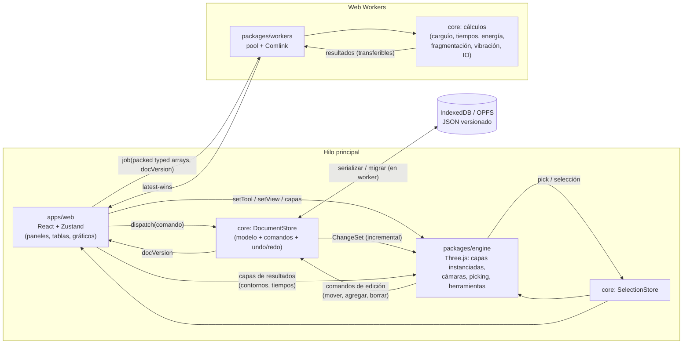

# Arquitectura de BlastLab

## Flujo de datos

## Paquetes

### `packages/core`

El corazón del sistema. Contiene:

- el modelo de dominio y sus tipos, con unidades SI y esquema versionado
- el `DocumentStore`, basado en comandos, ChangeSets, transacciones y undo/redo
- la geometría, los generadores de patrón y todos los cálculos de ingeniería
- el IO (JSON con migraciones, CSV, DXF)
- el empaquetado en typed arrays para el engine y los workers

No tiene dependencias del DOM ni de UI, así que corre en Node (tests), en workers y en el hilo principal. Todo cálculo es una función pura: `(modelo empaquetado, parámetros) → resultado`.

### `packages/engine`

Renderiza el diseño con Three.js sobre WebGL. Tiene una sola escena y dos cámaras: ortográfica para la planta y perspectiva para el 3D. Las entidades masivas usan InstancedMesh: símbolos y cilindros de taladros, y decks como segmentos instanciados con `instanceColor`.

Detalles de funcionamiento:

- **Loop:** usa un rAF propio con render a demanda.
- **Precisión:** trabaja en coordenadas relativas al origen local.
- **Picking y selección:** se resuelven con un índice espacial 2D (flatbush).
- **Herramientas de edición:** convierten eventos de puntero en comandos de core, con snapping y agrupadas en transacciones para undo.
- **Suscripción:** se suscribe al DocumentStore y actualiza solo las instancias afectadas.

Expone una API imperativa (`createEngine(canvas, deps)`, `setView`, `setTool`, `setLayer`, `focus`, `dispose`) y eventos (`hover`, `pointerWorld`, `fps`).

### `packages/workers`

Expone los cálculos de core en Web Workers mediante Comlink. Detalles:

- **Pool:** dimensionado según `hardwareConcurrency`.
- **Cancelación:** los jobs se etiquetan con `docVersion` y se descarta lo obsoleto (_latest-wins_).
- **Transferencia:** los datos entran y salen como typed arrays transferibles, sin copias de grafos de objetos.
- **Tareas largas:** serialización, autosave y generación de PDF también corren aquí.

### `apps/web`

Aplicación React + Vite:

- `<Viewport>` monta el canvas y crea el engine una sola vez; React nunca vuelve a renderizar el diseño.
- Zustand guarda el estado de UI, `docVersion` y la selección visible.
- Los paneles leen del DocumentStore con selectores memoizados.
- Los gráficos usan ECharts con carga diferida.
- La persistencia usa IndexedDB para el índice y el JSON de proyectos, y OPFS para los binarios grandes.

## Decisiones clave

| Decisión                              | Motivo                                                                                           |
| ------------------------------------- | ------------------------------------------------------------------------------------------------ |
| Simulación 100 % en cliente           | Latencia cero y funcionamiento offline; el backend futuro se limita a auth, persistencia y lotes |
| Document store en core, no en Zustand | Evita que React se re-renderice en ediciones masivas; undo/redo testeable en Node                |
| ChangeSets incrementales              | Actualizar 1 taladro no reconstruye 20.000 instancias                                            |
| Origen local en render                | float32 en la GPU no tiene precisión con coordenadas UTM                                         |
| Picking con flatbush                  | O(log n) frente a un raycast lineal sobre instancias                                             |
| TS primero, WASM después              | Solo se migra un kernel cuando una medición lo justifique                                        |
