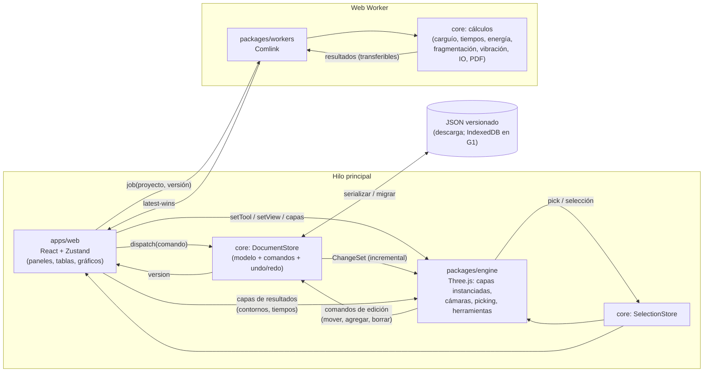

# Arquitectura de Cronos

Las decisiones de fondo están en `docs/decisiones/` (D-01…D-11), y la hoja de ruta en `docs/PLAN.md`.

## Flujo de datos


```mermaid
flowchart LR
  subgraph Main["Hilo principal"]
    direction TB
    UI["apps/web<br/>React + Zustand<br/>(paneles, tablas, gráficos)"]
    DOC["core: DocumentStore<br/>(modelo + comandos + undo/redo)"]
    SEL["core: SelectionStore"]
    ENG["packages/engine<br/>Three.js: capas instanciadas,<br/>cámaras, picking, herramientas"]
  end
  subgraph Workers["Web Worker"]
    API["packages/workers<br/>Comlink"]
    CALC["core: cálculos<br/>(carguío, tiempos, energía,<br/>fragmentación, vibración, IO, PDF)"]
  end
  STORE[("JSON versionado<br/>(descarga; IndexedDB en G1)")]

  UI -- "dispatch(comando)" --> DOC
  UI -- "setTool / setView / capas" --> ENG
  ENG -- "comandos de edición<br/>(mover, agregar, borrar)" --> DOC
  ENG -- "pick / selección" --> SEL
  DOC -- "ChangeSet (incremental)" --> ENG
  DOC -- "version" --> UI
  SEL --> ENG
  SEL --> UI
  UI -- "job(proyecto, versión)" --> API
  API --> CALC
  CALC -- "resultados (transferibles)" --> API
  API -- "latest-wins" --> UI
  UI -- "capas de resultados<br/>(contornos, tiempos)" --> ENG
  DOC <-- "serializar / migrar" --> STORE
```

## Estructura del monorepo

```
packages/core/src/      dominio y cálculos; sin DOM (Node, workers y hilo principal)
  model/                tipos del dominio, fábricas, librería inicial, SCHEMA_VERSION
  units/                conversiones SI ↔ presentación
  geometry/             trayectoria del taladro, polígonos, índice espacial, snapping, sólidos
  document/             DocumentStore, comandos, ops con inversa, SelectionStore
  patterns/             generación de mallas
  charging/             decks, kg/taladro, factores, cubicación (Voronoi)
  timing/               red de iniciación (Dijkstra), plantillas de amarre, isócronas
  energy/               Holmberg–Persson y densidad de carga sobre una grilla, contornos
  fragmentation/        Kuz-Ram, Swebrec
  vibration/            PPV, sobrepresión, Lundborg
  diagnostics/          revisión del diseño (chequeos de cordura)
  analysis/             orquestación de los análisis de una voladura
  io/                   JSON (+ migraciones, zod), CSV, DXF
  scenarios/            proyectos de ejemplo (se renombra a examples/ en G1)
packages/engine/src/    Three.js: Engine.ts, loop, cameras, input, layers, picking, tools, scene3d
packages/workers/src/   compute.worker.ts, computeApi.ts, client.ts, report/ (PDF)
apps/web/src/           React: viewport, panels, dialogs, charts, stores, analysis (runner)
```

## Paquetes

| Paquete   | Responsabilidad                                                  | Depende de            | Externas principales                   |
| --------- | ---------------------------------------------------------------- | --------------------- | -------------------------------------- |
| `core`    | Modelo, DocumentStore, cálculos, IO                              | —                     | zod, flatbush, d3-delaunay, dxf-parser |
| `engine`  | Escena, cámaras, capas instanciadas, picking, herramientas, loop | core                  | three                                  |
| `workers` | Cálculos de core e informe PDF fuera del hilo principal          | core                  | comlink, pdf-lib                       |
| `web`     | UI React, paneles, gráficos, orquestación                        | core, engine, workers | react, zustand, echarts, lucide-react  |

El grafo no tiene ciclos: `core ← engine`, `core ← workers`, `{core, engine, workers} ← web`. `engine` no conoce a `workers`: los resultados le llegan a través de la app. Los paquetes internos se consumen desde el fuente (`exports: "./src/index.ts"`).

## Modelo de dominio

La fuente de verdad es `packages/core/src/model/types.ts` (esquema en `model/schema.ts`, validación en `io/projectSchema.ts`). Convenciones:

- **Coordenadas:** X = Este, Y = Norte, Z = cota hacia arriba, en el CRS (EPSG) del proyecto.
- **Ángulos:** inclinación desde la vertical (0 = vertical); azimut horario desde el Norte.
- **Unidades internas SI estrictas** (D-10): m, kg, s, rad, Pa, J/kg, kg/m³, m/s. Por eso los tiempos van en s (no en ms) y el PPV en m/s (no en mm/s). Los casos de referencia en ms o mm/s se convierten en el test, y la presentación convierte según `displayUnits`.
- **Referencias por `Id`**. La librería de productos es una copia congelada dentro del proyecto, así que cambiar el catálogo no altera un diseño cerrado (`03 §1`, principio 6).
- **Resultados derivados:** nunca se persisten; se recalculan desde el diseño.
- **Cambios de esquema:** incrementan `SCHEMA_VERSION` y agregan una migración en `io/projectFile.ts` (`MIGRATIONS`) con su test.

## Comunicación React ↔ engine ↔ workers

- **DocumentStore** (core, TS puro) es la fuente de verdad.
  - Toda mutación pasa por `dispatch(command)`, que produce ops primitivas con su inversa para undo/redo.
  - Las ediciones continuas (arrastrar) se agrupan en una transacción: un solo paso de undo.
- **Engine** se suscribe al store y aplica solo el ChangeSet: actualiza las instancias afectadas y marca el frame como _dirty_. Sus herramientas traducen punteros en comandos; React no participa en ese camino.
- **React/Zustand** guarda el estado de UI (herramienta, vista, paneles), la versión del documento y la selección visible.
  - Los paneles leen del DocumentStore con selectores memoizados por versión.
  - La UI emite comandos al engine (`setTool`, `setView`, `focus`, capas) y al store (`dispatch`).
- **Worker** (uno solo por ahora):
  - `apps/web/src/analysis/runner.ts` pide los cálculos con debounce y aplica _latest-wins_: descarta un resultado si el documento cambió mientras se calculaba.
  - Los resultados vuelven a Zustand (tablas, gráficos) y al engine como capas (contornos, isócronas, colores por tiempo).
  - El pool de varios workers se agrega solo si una medición lo pide.
- **Persistencia:** hoy el proyecto se guarda o abre como JSON descargado. El autoguardado en IndexedDB llega en G1 (H-102).

## Vocabulario: término minero ↔ identificador

Terminología según `docs/theory/references/R1 - Primer minero a desarrollador.md` §2 (glosario). La UI y los documentos usan el término en español; el código usa el identificador. Las filas marcadas «(G_)» todavía no existen en el código y se crean en ese hito con ese nombre.

| Término (ES)                                 | EN                               | Identificador                                            | Unidad interna             |
| -------------------------------------------- | -------------------------------- | -------------------------------------------------------- | -------------------------- |
| Banco, altura de banco (H)                   | bench, bench height              | `Bench`, `bench.height`                                  | m                          |
| Cara libre                                   | free face                        | `FreeFace`, `blast.freeFaces`                            | —                          |
| Cresta / pie                                 | crest / toe                      | `FreeFace.crest`, `FreeFace.toe`                         | m                          |
| Burden (B)                                   | burden                           | `pattern.burden`                                         | m                          |
| Burden efectivo                              | effective burden                 | `effectiveBurden` (G5)                                   | m                          |
| Espaciamiento (S)                            | spacing                          | `pattern.spacing`                                        | m                          |
| Malla cuadrada / rectangular / tres bolillos | square / rectangular / staggered | `PatternKind`                                            | —                          |
| Rigidez H/B                                  | stiffness ratio                  | `stiffnessRatio` (G3)                                    | —                          |
| Taladro                                      | blast hole                       | `Hole`                                                   | —                          |
| Collar (boca)                                | collar                           | `hole.collar`                                            | m                          |
| Diámetro (Ø)                                 | diameter                         | `hole.diameter`                                          | m                          |
| Longitud del taladro (L)                     | hole length                      | `hole.length`                                            | m                          |
| Sobreperforación (J)                         | subdrilling                      | `hole.subdrill`                                          | m                          |
| Inclinación / azimut                         | dip (from vertical) / bearing    | `hole.inclination`, `hole.azimuth`                       | rad                        |
| Grupo (precorte, buffer, producción)         | presplit, buffer, production     | `HoleGroup` (G1)                                         | —                          |
| Taco (T)                                     | stemming                         | `StemmingDeck`, `StemmingMaterial`                       | m                          |
| Deck (tramo)                                 | deck                             | `Deck`                                                   | m                          |
| Cámara de aire                               | air deck                         | `AirDeck`                                                | m                          |
| Separador / tapón                            | spacer, stem plug                | `PlugDeck`                                               | m                          |
| Densidad lineal de carga (DCL)               | linear charge density            | `linearChargeDensity()`                                  | kg/m                       |
| Esponjamiento (gasificación)                 | gassing swell                    | `Explosive.gassing` (G1)                                 | m                          |
| Carga por taladro (Q)                        | charge per hole                  | `HoleCharge`                                             | kg                         |
| Factor de carga                              | loading factor                   | `loadingFactor` (G4; hoy `powderFactorVolume`)           | kg/m³                      |
| Factor de potencia                           | powder factor                    | `powderFactor` (G4; hoy `powderFactorMass`)              | kg/kg (se muestra en kg/t) |
| Factor de energía                            | energy factor                    | `energyFactor` (G4)                                      | J/kg (se muestra en MJ/t)  |
| Profundidad escalada de enterramiento (SDOB) | scaled depth of burial           | `scaledDepthOfBurial` (G4)                               | m/kg^(1/3)                 |
| Distancia escalada de vibración              | scaled distance                  | `scaledDistance` (G6; hoy implícita en `ppvAt()`)        | m/kg^(1/2)                 |
| Booster (cebo, prima)                        | booster / primer                 | `Primer`                                                 | kg                         |
| Detonador                                    | detonator                        | `Detonator`, `InHoleInitiator`                           | —                          |
| Conector de superficie                       | surface delay connector          | `SurfaceConnector`                                       | —                          |
| Retardo (de fondo / de superficie)           | delay (downhole / surface)       | `InHoleInitiator.delay`, `SurfaceConnection`             | s                          |
| Amarre                                       | tie-up                           | `InitiationPlan.connections`, `timing/tieUp.ts`          | —                          |
| Isotiempos                                   | isochrones                       | `computeIsochrones()`                                    | s                          |
| Carga máxima instantánea (MIC)               | max. instantaneous charge        | `TimingResult.maxChargePerWindow`, `VibrationResult.mic` | kg                         |
| Velocidad pico de partícula (PPV)            | peak particle velocity           | `ppvAt()`                                                | m/s                        |
| Onda aérea (sobrepresión)                    | airblast                         | `airblastAt()`                                           | Pa                         |
| Proyección de rocas                          | flyrock                          | `lundborgRange()`                                        | m                          |
| Punto de monitoreo                           | monitoring point                 | `MonitoringPoint`                                        | —                          |
| Factor de roca (A)                           | rock factor                      | `RockMass.rockFactor`                                    | —                          |
| X50, P80                                     | median / 80 % passing size       | `FragmentationResult.x50`, `.p80`                        | m                          |

## Decisiones clave

| Decisión                                                        | Motivo                                                                                            |
| --------------------------------------------------------------- | ------------------------------------------------------------------------------------------------- |
| Simulación 100 % en cliente, sin backend por ahora (D-02, D-08) | Latencia cero y funcionamiento offline. Usuarios, roles y auditoría esperan a la fase con backend |
| Document store en core, no en Zustand                           | Evita que React se re-renderice en ediciones masivas; undo/redo testeable en Node                 |
| ChangeSets incrementales                                        | Actualizar 1 taladro no reconstruye 20.000 instancias                                             |
| Origen local en render                                          | float32 en la GPU no tiene precisión con coordenadas UTM; se recentra a más de 5 km               |
| Picking con flatbush en el hilo principal                       | O(log n), interactivo y síncrono; reconstruir cuesta ~1–2 ms                                      |
| TS primero, WASM después                                        | Solo se migra un kernel cuando una medición lo justifique                                         |
| Arrastre con preview en el engine                               | Solo se mueven instancias en la GPU; el documento recibe un único comando al soltar               |
| Operaciones con inversa exacta                                  | El store guarda ops primitivas y sus inversas, no copias del proyecto                             |
| Símbolos y etiquetas en espacio de pantalla                     | Quads instanciados de tamaño constante; etiquetas con atlas de glifos y LOD                       |
| DXF R12 propio para escribir                                    | Conserva Z en todas las entidades; dxf-parser para leer                                           |
| Informe PDF vectorial en el worker                              | pdf-lib no depende del DOM                                                                        |
| 3D sobre la misma escena                                        | Reutiliza documento, origen de render y loop a demanda                                            |
| i18n sin librería (D-11)                                        | Diccionario tipado: una clave faltante en inglés es un error de compilación                       |
| Fórmulas con fuente y caso de referencia (D-06)                 | Guía §9–§11: ninguna regla minera sin cita; pruebas con valores externos                          |
