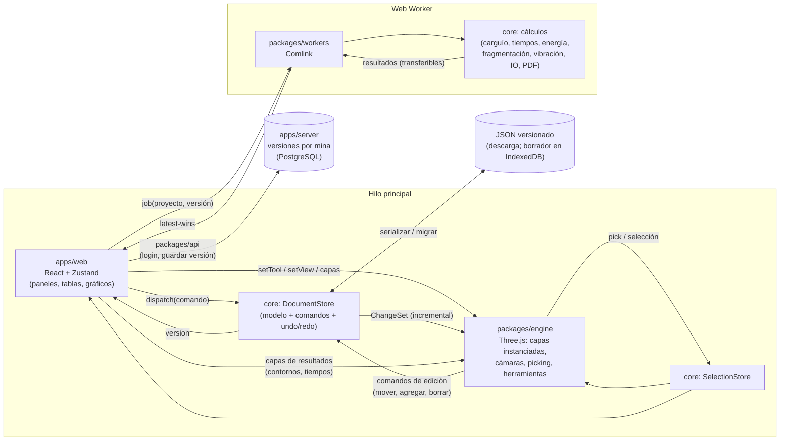

# Arquitectura de Cronos

Las decisiones de fondo están en `docs/DECISIONS.md` (D-01…D-14), y la hoja de ruta en `docs/ROADMAP.md`.

## Flujo de datos


```mermaid
flowchart LR
  subgraph Main["Hilo principal"]
    direction TB
    UI["apps/web<br/>React + Zustand<br/>(paneles, tablas, gráficos)"]
    DOC["core: DocumentStore<br/>(modelo + comandos + undo/redo)"]
    SEL["core: SelectionStore"]
    ENG["packages/engine<br/>Three.js: capas instanciadas,<br/>cámaras, picking, herramientas"]
  end
  subgraph Workers["Web Worker"]
    API["packages/workers<br/>Comlink"]
    CALC["core: cálculos<br/>(carguío, tiempos, energía,<br/>fragmentación, vibración, IO, PDF)"]
  end
  STORE[("JSON versionado<br/>(descarga; borrador en IndexedDB)")]
  SRV[("apps/server<br/>versiones por mina<br/>(PostgreSQL)")]

  UI -- "dispatch(comando)" --> DOC
  UI -- "setTool / setView / capas" --> ENG
  ENG -- "comandos de edición<br/>(mover, agregar, borrar)" --> DOC
  ENG -- "pick / selección" --> SEL
  DOC -- "ChangeSet (incremental)" --> ENG
  DOC -- "version" --> UI
  SEL --> ENG
  SEL --> UI
  UI -- "job(proyecto, versión)" --> API
  API --> CALC
  CALC -- "resultados (transferibles)" --> API
  API -- "latest-wins" --> UI
  UI -- "capas de resultados<br/>(contornos, tiempos)" --> ENG
  DOC <-- "serializar / migrar" --> STORE
  UI -- "packages/api<br/>(login, guardar versión)" --> SRV
```

## Estructura del monorepo

```
packages/core/src/      dominio y cálculos; sin DOM (Node, workers y hilo principal)
  model/                tipos del dominio, fábricas, librería inicial, SCHEMA_VERSION
  units/                conversiones SI ↔ presentación
  geometry/             trayectoria del taladro, polígonos, índice espacial, snapping, sólidos
  document/             DocumentStore, comandos, ops con inversa, SelectionStore
  patterns/             generación de mallas
  charging/             decks, kg/taladro, factores, cubicación (Voronoi)
  timing/               red de iniciación (Dijkstra), plantillas de amarre, isócronas
  energy/               Holmberg–Persson y densidad de carga sobre una grilla, contornos
  fragmentation/        Kuz-Ram, Swebrec
  vibration/            PPV, sobrepresión, Lundborg
  diagnostics/          revisión del diseño (chequeos de cordura)
  analysis/             orquestación de los análisis de una voladura
  io/                   JSON (+ migraciones, zod), CSV, DXF
  examples/             proyectos de ejemplo (menú Ejemplos)
packages/engine/src/    Three.js: Engine.ts, loop, cameras, input, layers, picking, tools, scene3d, xr (VR, D-19)
packages/workers/src/   compute.worker.ts, computeApi.ts, client.ts, report/ (PDF)
apps/web/src/           React: viewport, panels, dialogs, charts, stores, analysis (runner)
packages/api/src/       contratos HTTP (zod) y cliente fetch tipado
apps/server/src/        Fastify: login (Better Auth), empresas, minas, proyectos, versiones, auditoría
```

## Paquetes

| Paquete   | Responsabilidad                                                            | Depende de                 | Externas principales                     |
| --------- | -------------------------------------------------------------------------- | -------------------------- | ---------------------------------------- |
| `core`    | Modelo, DocumentStore, cálculos, IO                                        | —                          | zod, flatbush, d3-delaunay, dxf-parser   |
| `engine`  | Escena, cámaras, capas instanciadas, picking, herramientas, loop           | core                       | three                                    |
| `workers` | Cálculos de core, informe PDF y física de la pila fuera del hilo principal | core                       | comlink, pdf-lib, rapier3d-compat (D-17) |
| `web`     | UI React, paneles, gráficos, orquestación                                  | core, engine, workers, api | react, zustand, echarts, lucide-react    |
| `api`     | Contratos HTTP y cliente tipado                                            | core                       | zod                                      |
| `server`  | Login, empresas, minas, proyectos, versiones y auditoría                   | core, api                  | fastify, better-auth, kysely, pg         |

El grafo no tiene ciclos: `core ← engine`, `core ← workers`, `core ← api`, `{core, api} ← server`, `{core, engine, workers, api} ← web`. `engine` no conoce a `workers`: los resultados le llegan a través de la app. Los paquetes internos se consumen desde el fuente (`exports: "./src/index.ts"`).

## Modelo de dominio

La fuente de verdad es `packages/core/src/model/types.ts` (esquema en `model/schema.ts`, validación en `io/projectSchema.ts`). Convenciones:

- **Coordenadas:** X = Este, Y = Norte, Z = cota hacia arriba, en el CRS (EPSG) del proyecto.
- **Ángulos:** inclinación desde la vertical (0 = vertical); azimut horario desde el Norte.
- **Unidades internas SI estrictas** (D-10): m, kg, s, rad, Pa, J/kg, kg/m³, m/s. Por eso los tiempos van en s (no en ms) y el PPV en m/s (no en mm/s). Los casos de referencia en ms o mm/s se convierten en el test, y la presentación convierte según `displayUnits`.
- **Referencias por `Id`**. La librería de productos es una copia congelada dentro del proyecto, así que cambiar el catálogo no altera un diseño cerrado (`03 §1`, principio 6).
- **Resultados derivados:** nunca se persisten; se recalculan desde el diseño.
- **Cambios de esquema:** incrementan `SCHEMA_VERSION` y agregan una migración en `io/projectFile.ts` (`MIGRATIONS`) con su test.

## Comunicación React ↔ engine ↔ workers

- **DocumentStore** (core, TS puro) es la fuente de verdad.
  - Toda mutación pasa por `dispatch(command)`, que produce ops primitivas con su inversa para undo/redo.
  - Las ediciones continuas (arrastrar) se agrupan en una transacción: un solo paso de undo.
- **Engine** se suscribe al store y aplica solo el ChangeSet: actualiza las instancias afectadas y marca el frame como _dirty_. Sus herramientas traducen punteros en comandos; React no participa en ese camino.
- **React/Zustand** guarda el estado de UI (herramienta, vista, paneles), la versión del documento y la selección visible.
  - Los paneles leen del DocumentStore con selectores memoizados por versión.
  - La UI emite comandos al engine (`setTool`, `setView`, `focus`, capas) y al store (`dispatch`).
- **Worker** (uno solo por ahora):
  - `apps/web/src/analysis/runner.ts` pide los cálculos con debounce y aplica _latest-wins_: descarta un resultado si el documento cambió mientras se calculaba.
  - Los resultados vuelven a Zustand (tablas, gráficos) y al engine como capas (contornos, isócronas, colores por tiempo).
  - El pool de varios workers se agrega solo si una medición lo pide.
  - Excepción (D-17): la animación física de la pila corre en su propio worker (`physics.worker.ts`, Rapier), creado solo al pedirla, para no bloquear el de cómputo. Simula todo y devuelve cuadros que el engine reproduce con el reloj de la secuencia.
- **Persistencia:** JSON descargable y autoguardado en IndexedDB (`apps/web/src/persistence/`, D-03). Con servidor (D-14), el autoguardado es el borrador y «Guardar versión» publica una versión inmutable del proyecto en su mina.

## Realidad virtual (D-19)

- **WebXR en la misma web:** `Engine.enterXr('vr' | 'ar')` (desde el clic del usuario) fuerza la vista 3D y crea una `XrSession` (`engine/src/xr/`). La sesión es de solo lectura: no emite comandos.
- **Ubicación, no transformación:** `scene3d.root` se cuelga de un grupo cuya matriz es `placement.ts` (Z arriba → Y arriba, escala y giro, coordenadas relativas al origen). Volar, girar, teletransportarse, pasar a maqueta o colocarla en AR cambia solo esa matriz; al salir la raíz vuelve a la escena.
- **Loop:** con la sesión, `RenderLoop.setXr` pasa a `renderer.setAnimationLoop` (el navegador marca 72–90 Hz); al salir vuelve el render a demanda. La secuencia usa el reloj de pared y no cambia.
- **El engine dibuja y la web decide:** el engine emite `xrSelectHole`, `xrAction`, `xrView` y `xrSession`; `apps/web/src/xr/bindXr.ts` arma los textos con `t()` y usa las acciones y resultados de siempre (`setXrMenu`, `setXrInfo`). Las etiquetas pasan a metros del espacio de vista (`LabelsLayer.setWorldSize`).
- **Multiusuario remoto:** `apps/web/src/xr/room.ts` abre `GET /api/rooms/:projectId/:version/ws` (WebSocket con la cookie de sesión). El servidor (`routes/rooms.ts`) es un relé en memoria: valida cada mensaje con zod (`packages/api/src/rooms.ts`), reenvía poses y guarda el último estado del presentador. Ningún cálculo pasa por el servidor.

## Servidor, empresas e historial (D-14)

- **Plataforma (D-15):** cada persona es de una sola empresa. El superadministrador (`user.isSuperAdmin`) es el dueño del software, no pertenece a ninguna empresa (triggers en la base) y administra las empresas desde `/platform` (`routes/platform.ts`): las crea con su primer administrador, ve sus números y desactiva empresas o cuentas sin borrar datos.
- **Jerarquía:** empresa (`Organization`) > mina (`Mine`) > proyecto > versiones (`ProjectVersion`). El rol del miembro (`Member.role`: `admin`, `designer`, `reviewer`) se asigna en la empresa; una mina con filas en `mine_access` solo la ven esos usuarios (y los administradores).
- **Versión inmutable:** guarda el `ProjectFile` completo (gzip), su hash, autor, fecha, mensaje y un resumen de cambios calculado con `diffProjects` de core. Restaurar crea una versión nueva; nada se reescribe.
- **Concurrencia optimista:** publicar envía la versión base; si otro publicó antes, el servidor responde 409.
- **Guardar versión** (web): el worker calcula `diffProjects` entre la versión base y el documento para mostrar qué cambió; se pide un mensaje y se publica el JSON serializado por el worker. Si la base ya no es la última (409), se ofrece guardar los cambios como proyecto nuevo, descargarlos o descartarlos. El historial del proyecto permite consultar una versión anterior en solo lectura (`/projects/:id/versions/:n`) o restaurarla.
- **Historial de la mina** (`/mines/:id/history`, `GET /mines/:id/versions`): todas las versiones de todos los proyectos de la mina, de la más nueva a la más vieja, agrupadas por día, con filtros por proyecto, autor y fechas; cada una se abre (solo lectura si no es la última) o se descarga como `.cronos.json`. La paginación usa el cursor (fecha, id) de la última versión recibida.
- **Comparar versiones:** desde el historial del proyecto, el documento abierto se compara con cualquier versión anterior. El worker calcula `compareVersions` (`diffProjects` + `diffMarkers`) y el engine dibuja `VersionDiffLayer`: anillos verdes (agregados), rojos con cruz (quitados, en su posición anterior), naranjas con línea desde la posición anterior (movidos) y azules (cambiados). Si el documento cambia, se recalcula.
- **Borrador local:** el autoguardado sigue en IndexedDB y cada borrador guarda su `baseVersionId`; al abrir el proyecto, un borrador posterior a la versión base se ofrece para recuperar. Salir con cambios sin publicar pide confirmación.
- **Auditoría:** `audit_event` solo admite inserciones (quién, cuándo, qué).
- **El servidor valida** todo proyecto con `parseProjectFile` (migra y valida con zod) antes de guardarlo.
- **Cuentas:** no hay registro público; el administrador crea la cuenta con una contraseña que no hace falta cambiar (guía H-801); una cuenta marcada como temporal (`reset-password --temporal`) solo puede usar las rutas de `/me` hasta cambiarla. Los permisos por rol están en `packages/api/src/roles.ts` y los usan el servidor (que los hace cumplir) y la web (que solo muestra u oculta).
- **Tema visual:** tokens en `:root` de `apps/web/src/styles.css` (roca volcánica, crisocola como acento, ámbar para tiempo y detonación, azurita para información) y tipografía Barlow autoalojada (`@fontsource`, OFL). Los estilos del modo servidor están en `apps/web/src/server.css`.
- **Web en modo servidor** (`apps/web/src/pages/`): React Router con `/` (minas de la empresa activa), `/mines/:id`, `/admin` (usuarios, roles, acceso a minas y auditoría) y `/projects/:id` (el editor de siempre con la última versión del proyecto; `server/projectSession.ts`). El JSON de una versión se parsea y valida en el worker; para el revisor el DocumentStore queda en solo lectura (`setReadOnly`: `dispatch` no aplica nada y avisa con `onReadOnlyAttempt`). Los datos de la empresa viven en `stores/workspaceStore.ts`, no en el DocumentStore.
- **Sin servidor** (`VITE_API_URL` vacío) la app funciona como antes: sin login y solo con el autoguardado local.

## Vocabulario: término minero ↔ identificador

Terminología según `docs/theory/references/R1-MINING-PRIMER.md` §2 (glosario). La UI y los documentos usan el término en español; el código usa el identificador. Las filas marcadas «(G_)» todavía no existen en el código y se crean en ese hito con ese nombre.

| Término (ES)                                 | EN                               | Identificador                                                                | Unidad interna             |
| -------------------------------------------- | -------------------------------- | ---------------------------------------------------------------------------- | -------------------------- |
| Banco, altura de banco (H)                   | bench, bench height              | `Bench`, `bench.height`                                                      | m                          |
| Cara libre                                   | free face                        | `FreeFace`, `blast.freeFaces`                                                | —                          |
| Cresta / pie                                 | crest / toe                      | `FreeFace.crest`, `FreeFace.toe`                                             | m                          |
| Burden (B)                                   | burden                           | `pattern.burden`                                                             | m                          |
| Burden efectivo                              | effective burden                 | `effectiveBurden` (G5)                                                       | m                          |
| Espaciamiento (S)                            | spacing                          | `pattern.spacing`                                                            | m                          |
| Malla cuadrada / rectangular / tres bolillos | square / rectangular / staggered | `PatternKind`                                                                | —                          |
| Rigidez H/B                                  | stiffness ratio                  | `stiffnessRatio` (G3)                                                        | —                          |
| Taladro                                      | blast hole                       | `Hole`                                                                       | —                          |
| Collar (boca)                                | collar                           | `hole.collar`                                                                | m                          |
| Diámetro (Ø)                                 | diameter                         | `hole.diameter`                                                              | m                          |
| Longitud del taladro (L)                     | hole length                      | `hole.length`                                                                | m                          |
| Sobreperforación (J)                         | subdrilling                      | `hole.subdrill`                                                              | m                          |
| Inclinación / azimut                         | dip (from vertical) / bearing    | `hole.inclination`, `hole.azimuth`                                           | rad                        |
| Grupo (precorte, buffer, producción)         | presplit, buffer, production     | `HoleGroup` (G1)                                                             | —                          |
| Taco (T)                                     | stemming                         | `StemmingDeck`, `StemmingMaterial`                                           | m                          |
| Deck (tramo)                                 | deck                             | `Deck`                                                                       | m                          |
| Cámara de aire                               | air deck                         | `AirDeck`                                                                    | m                          |
| Separador / tapón                            | spacer, stem plug                | `PlugDeck`                                                                   | m                          |
| Densidad lineal de carga (DCL)               | linear charge density            | `linearChargeDensity()`                                                      | kg/m                       |
| Esponjamiento (gasificación)                 | gassing swell                    | `Explosive.gassing` (G1)                                                     | m                          |
| Carga por taladro (Q)                        | charge per hole                  | `HoleCharge`                                                                 | kg                         |
| Factor de carga                              | loading factor                   | `loadingFactor` (G4; hoy `powderFactorVolume`)                               | kg/m³                      |
| Factor de potencia                           | powder factor                    | `powderFactor` (G4; hoy `powderFactorMass`)                                  | kg/kg (se muestra en kg/t) |
| Factor de energía                            | energy factor                    | `energyFactor` (G4)                                                          | J/kg (se muestra en MJ/t)  |
| Profundidad escalada de enterramiento (SDOB) | scaled depth of burial           | `scaledDepthOfBurial` (G4)                                                   | m/kg^(1/3)                 |
| Distancia escalada de vibración              | scaled distance                  | `scaledDistance` (G6; hoy implícita en `ppvAt()`)                            | m/kg^(1/2)                 |
| Booster (cebo, prima)                        | booster / primer                 | `Primer`                                                                     | kg                         |
| Detonador                                    | detonator                        | `Detonator`, `InHoleInitiator`                                               | —                          |
| Conector de superficie                       | surface delay connector          | `SurfaceConnector`                                                           | —                          |
| Retardo (de fondo / de superficie)           | delay (downhole / surface)       | `InHoleInitiator.delay`, `SurfaceConnection`                                 | s                          |
| Amarre                                       | tie-up                           | `InitiationPlan.connections`, `timing/tieUp.ts`                              | —                          |
| Isotiempos                                   | isochrones                       | `computeIsochrones()`                                                        | s                          |
| Carga máxima instantánea (MIC)               | max. instantaneous charge        | `TimingResult.maxChargePerWindow`, `VibrationResult.mic`                     | kg                         |
| Velocidad pico de partícula (PPV)            | peak particle velocity           | `ppvAt()`                                                                    | m/s                        |
| Onda aérea (sobrepresión)                    | airblast                         | `airblastAt()`                                                               | Pa                         |
| Proyección de rocas                          | flyrock                          | `lundborgRange()`                                                            | m                          |
| Pila de material (muckpile)                  | muckpile                         | `MuckpileResult`, `simulateMuckpile()` (A7)                                  | m, m³                      |
| Esponjamiento de la roca volada              | swell (bulking) factor           | `calcParams.muckpile.swell` (≠ `Explosive.gassing`)                          | —                          |
| Ángulo de reposo                             | angle of repose                  | `calcParams.muckpile.reposeAngle`                                            | rad                        |
| Throw (avance del pie de la pila)            | throw                            | `MuckpileStats.throw`                                                        | m                          |
| Drop (bajada del techo)                      | drop                             | `MuckpileStats.maxDrop`, `meanDrop`                                          | m                          |
| Dominio de material o ley                    | material / grade domain          | `BlastDomain`, `blast.domains`                                               | —                          |
| Cara libre (talud): ángulo y alto            | free face (slope) angle, height  | `bench.faceAngle`, `BlastBoundary.faceAngle`, `faceHeight`, `boundaryFace()` | rad, m                     |
| Punto de monitoreo                           | monitoring point                 | `MonitoringPoint`                                                            | —                          |
| Factor de roca (A)                           | rock factor                      | `RockMass.rockFactor`                                                        | —                          |
| X50, P80                                     | median / 80 % passing size       | `FragmentationResult.x50`, `.p80`                                            | m                          |
| Empresa                                      | organization                     | `Organization`                                                               | —                          |
| Mina                                         | mine                             | `Mine`                                                                       | —                          |
| Miembro (rol en la empresa)                  | member                           | `Member`, `Member.role`                                                      | —                          |
| Versión del proyecto                         | project version                  | `ProjectVersion`                                                             | —                          |
| Evento de auditoría                          | audit event                      | `AuditEvent`                                                                 | —                          |
| Levantamiento topográfico                    | topographic survey               | `TopographySurvey`                                                           | —                          |
| Cresta / pie (líneas de referencia)          | crest / toe (reference lines)    | `ReferenceLine.role`                                                         | m                          |
| Curvas de nivel                              | contour lines                    | `contoursFromTin()`                                                          | m                          |

## Decisiones clave

| Decisión                                        | Motivo                                                                                             |
| ----------------------------------------------- | -------------------------------------------------------------------------------------------------- |
| Simulación 100 % en cliente (D-02)              | Latencia cero y funcionamiento offline. El servidor (D-14) solo guarda, valida y compara versiones |
| Document store en core, no en Zustand           | Evita que React se re-renderice en ediciones masivas; undo/redo testeable en Node                  |
| ChangeSets incrementales                        | Actualizar 1 taladro no reconstruye 20.000 instancias                                              |
| Origen local en render                          | float32 en la GPU no tiene precisión con coordenadas UTM; se recentra a más de 5 km                |
| Picking con flatbush en el hilo principal       | O(log n), interactivo y síncrono; reconstruir cuesta ~1–2 ms                                       |
| TS primero, WASM después                        | Solo se migra un kernel cuando una medición lo justifique                                          |
| Arrastre con preview en el engine               | Solo se mueven instancias en la GPU; el documento recibe un único comando al soltar                |
| Operaciones con inversa exacta                  | El store guarda ops primitivas y sus inversas, no copias del proyecto                              |
| Símbolos y etiquetas en espacio de pantalla     | Quads instanciados de tamaño constante; etiquetas con atlas de glifos y LOD                        |
| DXF R12 propio para escribir                    | Conserva Z en todas las entidades; dxf-parser para leer                                            |
| Informe PDF vectorial en el worker              | pdf-lib no depende del DOM                                                                         |
| 3D sobre la misma escena                        | Reutiliza documento, origen de render y loop a demanda                                             |
| i18n sin librería (D-11)                        | Diccionario tipado: una clave faltante en inglés es un error de compilación                        |
| Fórmulas con fuente y caso de referencia (D-06) | Guía §9–§11: ninguna regla minera sin cita; pruebas con valores externos                           |
